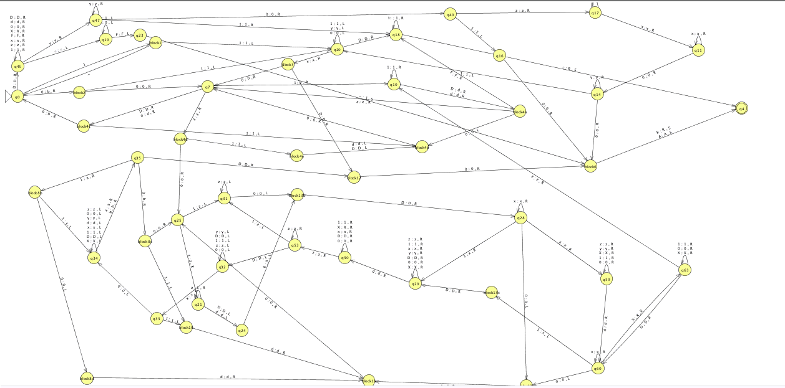
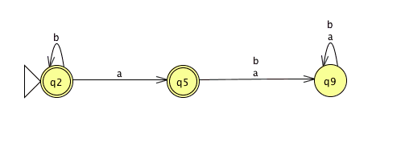
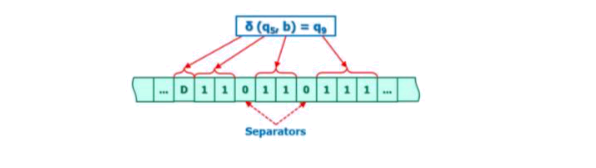
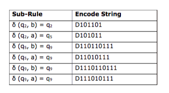
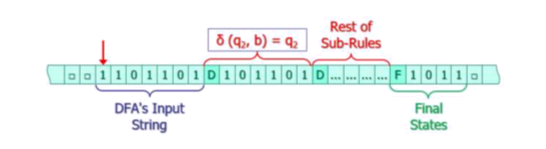

# Turing Machine
> Turing Machine that takes an encoded DFA and prints out A to accept or R to reject the string input 



# Description
This Standard Turing Machine simulates behavior of any Deterministic Finite Automata that is properly encoded. The machine will return A or R for accepting or rejecting a string. Run the FinalRelease.jff in the the transducer mode of JFLAP program. Please be aware of potential bugs in this machine. 

## Deterministic Finite Automata (DFA) Fundamentals
DFA can be mathematically defined as M = (Q,Σ,δ,q<sub>0</sub>,F), where:
* Q - List of states 
* Σ - Alphabet
* δ - Transition function
* q<sub>0</sub> - Initial state
* F - List of final(accepting) states 

### Example: 
L = {b<sup>n</sup>a<sup>m</sup>} where n &#8805; 0 and m = 0 or 1




Machine M constructed above can be mathematically broken down to:

* Q = {q<sub>2</sub>,q<sub>5</sub>,q<sub>9</sub>}
* Σ = {a,b}
* q<sub>0</sub> = q<sub>2</sub>
* F = {q<sub>2</sub>,q<sub>5</sub>}

Transition function δ of the constructed DFA above will be:
* δ(q<sub>2</sub>, b) = q<sub>2</sub>
* δ(q<sub>2</sub>, a) = q<sub>5</sub>
* δ(q<sub>5</sub>, b) = q<sub>9</sub>
* δ(q<sub>5</sub>, a) = q<sub>9</sub>
* δ(q<sub>9</sub>, b) = q<sub>9</sub>
* δ(q<sub>9</sub>, a) = q<sub>9</sub>

Let input string w = aab

## Encoding a DFA 

We will encode all element of M and w in unary numbers.

<b>Q = {q2, q5, q9}</b>
<br>The first element of Q is encoded as 1, the second one as 11 and so forth.
So, the encoded version of Q would be: Q = {1, 11, 111}

<b>q<sub>0</sub></b>
<br>We always put the initial state as the first element of Q. So, q<sub>0</sub> (e.g. q<sub>2</sub> in the example) is always encoded as 1.

<b>Σ = {a, b}</b>
<br>The first element of Σ is encoded as 1, the second one as 11 and so forth. So, the encoded version of Σ would be: Σ = {1, 11}

<b>F = {q<sub>2</sub>, q<sub>5</sub>}</b>
<br>The set of final states follows the same codes of Q. So, the encoded version of F would be F = {1, 11}.


<b>δ(q<sub>0</sub>, x) = q<sub>j</sub></b>
<br>The elements of sub-rules are encoded by the same codes of Q and Σ and are formatted as the following figure shows. We use '0' (zero) as the separator between the elements.




Note that q<sub>5</sub> and b have the same code (i.e. 11), but their locations in the string give them different meaning.
<br>All sub-rules of the example have been encoded in the following table. 




<b>Input string w = bba</b>

The symbols of the input string are encoded by the codes of Σ and are separated by '0' (zero). So, the encoded version of w would be: w = 1101101
<br>Let's put all together and construct the TM's input string that contains the DFA's description and its input string.




#### Final Result

After applying all of the rules of encoding our DFA will look like this:

```sh
1101101D101101D101011D110110111D11010111D1110110111D111010111F1011
```

### Technical Notes
1. The order of the elements of Q does not matter. The only restriction would be the first element that must be the q<sub>0</sub> of the DFA.
2. The order of the elements of Σ does not matter.
3. We don't need to put Q and Σ in the TM's input string because we just need to use their codes in δ, w, and F.
4. We assume that the input string of the TM is 100% correct. It means, M and w are encoded and formatted correctly. Therefore, your  TM is not supposed to have any error checking or error reporting.
5. Test your Turing machine as a transducer option of JFLAP.
6. There are bugs in this machine.

## Usage

Use JFLAP 7 provided in the repository. Run inputs in transducer mode.

## Meta

Danil Kolesnikov – danil.kolesnikov@sjsu.edu

Distributed under the MIT license.
